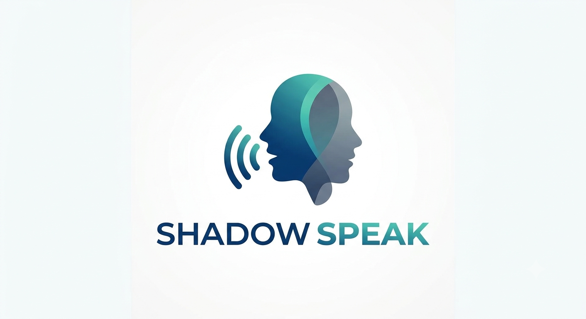

Aqui está a logo para o Shadow Speak! O design combina um perfil definido (o aluno) com uma 'sombra' fluida e ondas sonoras, representando a técnica de shadowing e a prática da fala. Usei tons modernos de azul e teia para dar um aspecto tecnológico e amigável.

